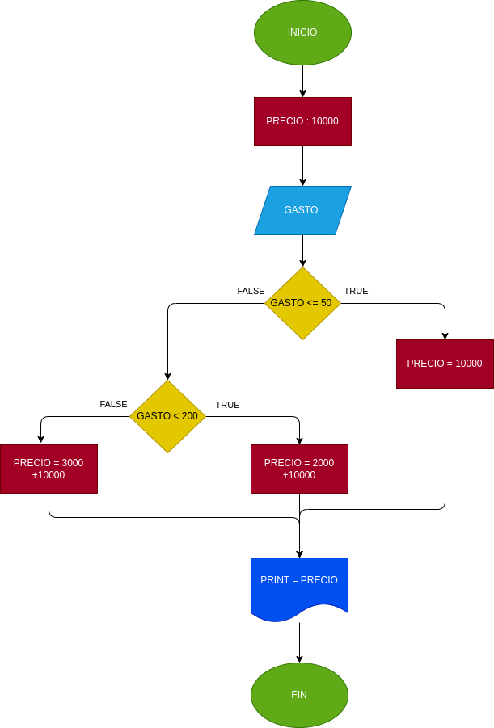

## GASTO DE AGUA
Programa para saber cuanto hay que pagar deacuerdo a su gasto de agua en m3
# ANALISIS

--Variables de entrada 

GASTO = cuantos m3 gasto de agua
PRECIO = 10000

--variables de proceso

GASTO = comparar y mirar cuantos m3 se gasto
PRECIO = el precio al quer le va allegar la factura

--Variables de salida

PRECIO = de acuerdo al proceso el lo que le llego la factura
--
# DISEÑO

# CONSTRUCCION