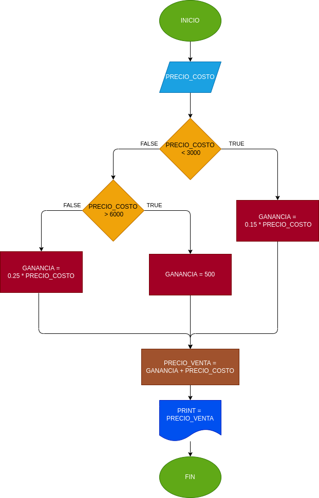

## PRECIO EN UNA PAPELERIA
Programa para saber el precio adecuado de venta en una papeleria de diferentes productos segun su precio
# ANALISIS

--Variables de entrada 

PRECIO_COSTO = la variable del precio al que compramos el producto

--variables de proceso

GANANCIA = es el precio de costo por el porcentaje nesesario deacuerdo al precio
PRECIO_VENTA = (GANANCIA + PRECIO_COSTO)

--Variables de salida

PRECIO_VENTA = es el precio obtimo para vender el producto

--
# DISEÑO

# CONSTRUCCION
