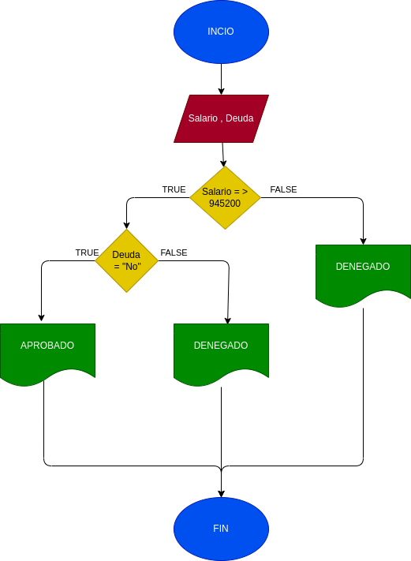

## Prestamo Bancario
Programa para si usted puede adquirir un prestamo en el banco segun su salario y si tiene de Deudas anteriores
# ANALISIS

Variables de entrada 

Salario = el dinero nesesario para daquirir el prestamo
Deuda = saber si tiene deudas anteriores

variables de proceso
salario >= numero ingresado
Deuda = si o no tienes deudas

Variables de salida

Aceptado = su prestamo fue aceptado
Denegado = su prestanmo fue denegado

Nos indicara si se acepto o se denego su prestamo

# DISEÑO

# CONSTRUCCION

